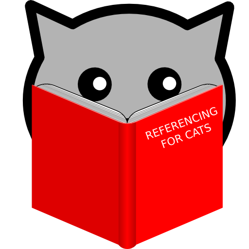
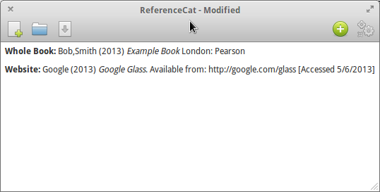
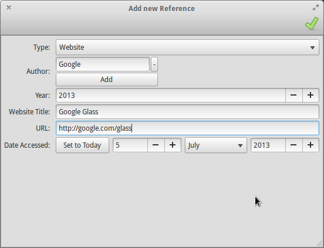

# Reference Cat

Reference Cat is a magical tool written in Python
(would have been html, but you can't write to a `<input type='file'/>`)
designed to do referencing quickly

I made it because at Uni etc you need to reference things properly, and
it's stupidly difficult and nothing really clicked fuffiling my criteria:

* Runs on Linux
* Doesn't look crap
* £0

It uses GTK right now, but it can be easily expanded.

It looks like this:

## Icon credit

* [Cat](http://thenounproject.com/noun/cat/#icon-No18061) designed by [Martin LEBRETON](http://thenounproject.com/Martin LEBRETON) from The Noun Project
* Idea by [Sami L](https://plus.google.com/102979615354596428339)
* Initial icon is accessories-dictionary.svg from the Elementary Desktop project

## State of things

### Things that don't work

* Export :(
* Delete individual references (although the button appears correctly)
* Crazy bugs with things

### Things I should change

* Move generic code out of the GTK module
* Split the GTK module into parts (main, edit, export)
* Make the generated reference a bit more human

### Things to do

* HTML5 backend as a server (then, I get it working on Win/OSX. Just fire up localhost!)
* Other backends if I can be bothered (but I use Linux, so meh HTML5 will do for everything else)
